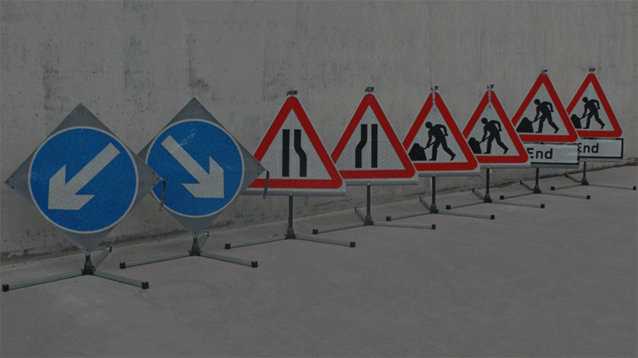

# Traffic Sign Detection



Traffic Sign Detection has been one of the crucial tasks in the development of self-driving cars. For intelligent decisions, the ego vehicle should be aware of different traffic signs like stopping, no entry, prohibitory signs, speed limit etc. Another aspect of this task is that the types of basic traffic signs remain more-or-less the same for different countries. More advanced signs pose a problem to a traffic sign detector due to language barriers. 


<br>
<center><i>Traffic Signs along Japanese road in Kanji</i></center>
</br>


## Introduction

This repository contains the scripts and notebook for Traffic Sign Detection using the **German Traffic Sign Recognition Benchmark (GTSRB)** which is one of the benchmarks in this task. This dataset is special because the signs are used in almost all countries where traffic signs are in English. The dataset consists of 39209 training images and 12630 test images. There are 43 classes of traffic signs. Download the dataset from Kaggle: [**GTSRB Dataset**](https://www.kaggle.com/datasets/meowmeowmeowmeowmeow/gtsrb-german-traffic-sign)


<center><i>43 classes in the GTSRB Dataset</i></center>

## Setup

### For Local Environment

The virtual environment uses `Python 3.8.0` and `tensorflow-gpu 2.2.0`. This environment is the same as that used in [**Deep Learning with Tensorflow 2 Specialization**](https://github.com/snehilsanyal/TensorFlow-2-for-Deep-Learning-Specialization-Coursera). Rest of the dependencies can be installed by running:
```
pip install -r requirements.txt
```

### Running on Cloud

Hop on to the Colab Notebook [**here**](https://colab.research.google.com/drive/1oUwEiaBiWZlMpSrhoEvDg1Doc9sl36Fg?usp=sharing) without installing anything.


## Code

```
├───.ipynb_checkpoints
├───assets
│   ├───43classes.png
│   ├───stop_sign.jpg
│   └───tomare.jpg
├───data
│   ├───Meta 
│   ├───Test
│   └───Train
|   |    ├───0
│   |    ├───1
|   |    |.....
│   |    └───43
|   |
│   ├───Meta.csv
│   ├───Test.csv
│   └───Train.csv
├───requirements.txt
├───traffic_sign_detection.ipynb              
└───models
```

After this, download the GTSRB dataset in the same directory inside the `data` folder. The `data` folder should contain `Meta`, `Train`, `Test` folders and `Meta`, `Train` and `Test` csv files. Run the notebook `traffic_sign_detection.ipynb` to visualize the results of training and inference. After the inference, the notebook will save the trained model in the `models` folder.

## Future Work
To create a custom object detection model only for traffic signs using YoloV8. Most of the available notebooks do object recognition on few types of traffic signs like prohibitory, stop. The output will be something like this, but for a varied number of traffic signs:


Countries with traffic signs other than in English, also need special attention (like Japan, Korea) as the work is less. We might have to include OCR for the specific country's language.

## References
1. [GTSRB Paper: Man vs. computer: Benchmarking machine learning algorithms for traffic sign recognition](https://www.sciencedirect.com/science/article/pii/S0893608012000457)
2. [GTSRB Dataset main site](https://benchmark.ini.rub.de/)
3. [Kaggle Dataset GTSRB](https://www.kaggle.com/datasets/meowmeowmeowmeowmeow/gtsrb-german-traffic-sign)
